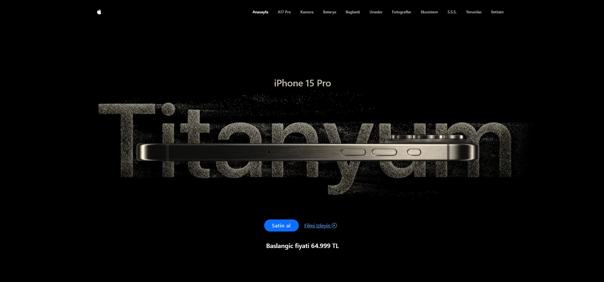
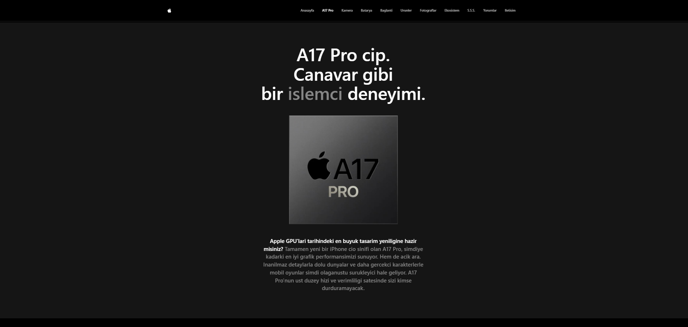
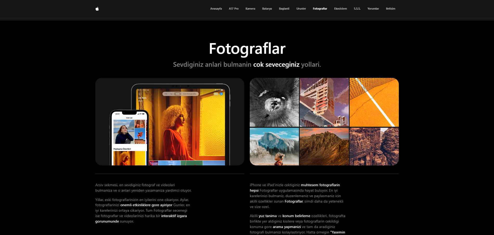
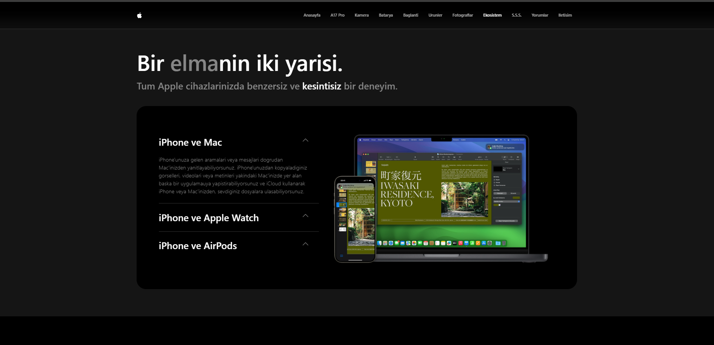

# Apple Webpage Clone

This project is a responsive clone of the official Apple website, created using Bootstrap, Swiper.js, Glightbox, and AOS.js. The goal of this project was to develop a visually appealing, responsive design with smooth scrolling animations and a dynamic slider experience.

## Live Site

[You can also click if you want to see the site live.](https://iphone15-rk.netlify.app/)

## Features

- **Fully Responsive Design:** Optimized for mobile, tablet, and desktop devices.
- **Glightbox Integration:** Videos play automatically and silently in a lightbox format.
- **Swiper.js Slider:** Interactive, responsive sliders for showcasing content.
- **AOS.js Animations:** Smooth, customizable scroll animations to enhance the user experience.

## Screenshots

## Libraries and Technologies Used

- HTML5
- CSS3
- Bootstrap 5
- Swiper.js (for the slider)
- AOS.js (for scroll animations)
- Glightbox (for video playback)
- JavaScript

## License

This project is for educational purposes and does not intend to replicate Apple’s website for commercial use.
